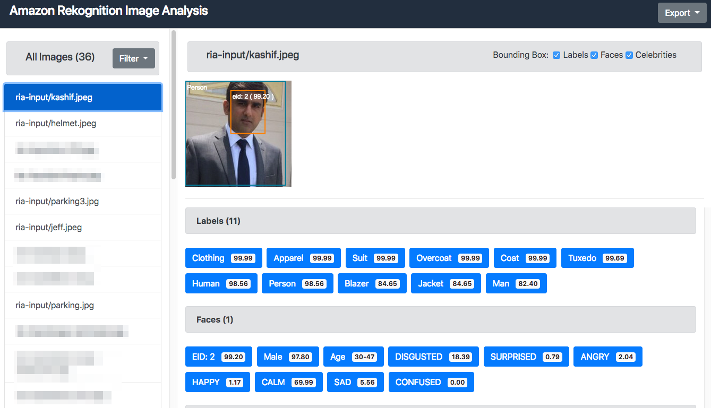
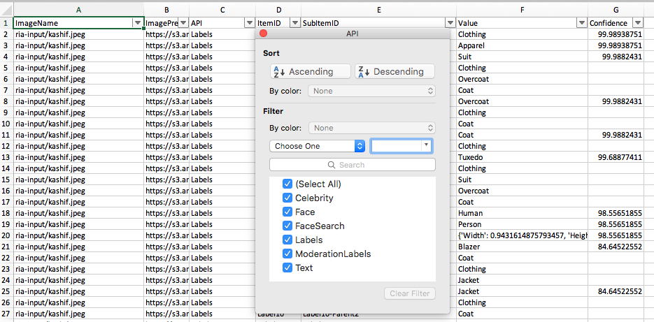

# PoC Tool to Analyze Batch of Images using Amazon Rekognition

## Prerequisites
- Python3
- [AWS CLI](https://docs.aws.amazon.com/cli/latest/userguide/installing.html)

## How to run RIA

- Download [ria.py.zip](./code/ria.py.zip)

- Follow one the formats below. input-bucket is required, whereas all other parameters are optional.
    - python3 ria.py --input-bucket your-bucket
    - python3 ria.py --input-bucket your-bucket --input-directory your-input-directory --output-bucket your-bucket --output-directory your-output-directory --min-confidence 50 --collection-id your-collection --s3-expiration-time 3600 --no-csv

## Output UI

## CSV Export of Metadata

